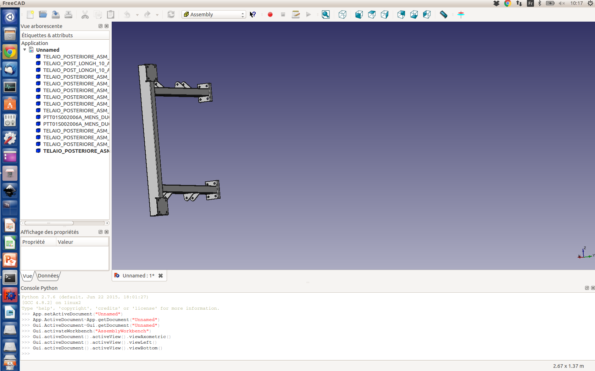

# Description 

This repository has been created during the Boot camp OSV from April 27 to 29  2016. 

## Objectifs

+ Capitaliser un maximum d'idées, de contenus, d'outils, de projets, ...., autour de la plateforme Open Source Vehicle
et de son usage possible dans le contexte local Rennais.

+ Disposer d'une base de départ pour aller plus loin (AAP) dans une phase ultérieure.

+ "Have fun together" 

## Règles du jeu 

+ Règle 1 : Le travail réalisé pendant la durée du boot camp est ouvert. 

+ Règle 2 : Les langues de travail sont indifféremment le français ou l'anglais (selon le contexte).

+ Règle 3 : Les projets sont définis après la présentation des règles du jeu.

+ Règle 4 : Chaque projet  dispose d'un répertoire sous de dépôt github (idéalement chaque équipe dispose d'un participant familier de l'utilisation de git, et se charge d'uploader le contenu digital produit (photos de tableaux, croquis, url , code ,....).

+ Règle 5 : Chaque équipe projet organise son répertoire propre selon, ses propres règles, définies collaborativement par les membres de l'équipe. 

## Liens Utiles

[Le Pad du Projet OSV (Trait d'union entre toutes les initiatives en cours ) ](https://annuel.framapad.org/p/osv-rennes)

[Description du Véhicule](http://bootcamposv.github.io/bcosv/)

L'un des résultats du boot camp OSV est l'amorçage du sous-projet OPEP, décrit ci-dessous.
 
# (OPEP project) OSV Parts Editing Project  

### Localisation des fichiers STEP

Les fichiers STEP sont déposés  à cette adresse  :

[Fichiers STEP](https://github.com/BootCampOSV/bcosv/tree/master/Doc/mechanics/stp)

Les fichiers STEP (extension .stp)  sont des fichiers de type texte ( visualisable en ligne sauf quand ils sont trop gros )

Celui ci par exemple :

[rear_frame.stp](https://github.com/BootCampOSV/bcosv/blob/master/Doc/mechanics/stp/rear_frame/rear_frame.stp)

Il est éditable avec [freecad](http://www.freecadweb.org/)et il peut servir d'exemple pour créer tous les autres fichiers sur le même principe.

(Ici la pièce a été renommée, à ce stade c'est sans doute une mauvaise idée, il vaut mieux nommer le fichier d'après le nom originel de la pièce). Assez vite, il faudra convenir d'une nomenclature de nommage simple, non équivoque et informative.  

_

## Comment participer à l'OPEP ?

1. Sous Windows installer [git pour windows](https://git-for-windows.github.io/)
    Sous linux : sudo apt-get install git
2. Se créer un compte github
3. Forker le répertoire bcosv sur son compte github 
4. Cloner le répertoire 
    git clone https://github.com/BootCampOSV/bcosv.git
5. Editer `ma_nouvelle_piece.stp`
6. Quand  le fichier est éditable sous [freecad](http://www.freecadweb.org/)
    - git add ma_nouvelle piece.stp 
    - git commit -a - m "Ajout de ma_nouvelle_piece.stp bla bla"
    - git push origin master 
7. Sur son compte github faire un pull request pour demander l'intégration de sa pièce dans le projet

# 28/05/2016

## Travail à faire    

 + **Milestone 1** (Achieved 80%) : 
  Tout le fichier STEP du véhicule OSV est découpé en blocs élémentaires. Chaque bloc est renommé avec une nomenclature appropriée (à débattre
  et organisé hiérarchiquement et fonctionnellement vis à vis des autres blocs du véhicule. La structure de graphe du châssis est dégagée (liens d'appartenance à un bloc et liens fonctionnels entre blocs).

 + **Milestone 2**(Achieved 0%): Les pièces du véhicule physique non présentes dans le fichier STEP original sont détaillées et ajoutées. Les méta informations sur chaque pièces sont ajoutées. (Fournisseurs, prix, masse, distance aux contraintes d'homologation... ) 
 + **Milestone 3**(Achieved 0%): Le véhicule complet est documenté, dans toute ses parties et consultable en ligne,  y compris le système d'informations, le châssis, la motorisation, le système de batterie, la carrosserie .
 + **Milestone 4** (Achieved 0%): Créer des évolutions sous formes de branches git de nouvelles évolutions du véhicule. (Autres motorisations, autres châssis, ajouts de capteurs, systèmes d'aide à la perception et à l'autonomisation....)  

# Let's start ...

### Structure d'un fichier

- Le fichier [rear_frame.stp](https://github.com/BootCampOSV/bcosv/blob/master/Doc/mechanics/stp/rear_frame/rear_frame.stp) peut servir d'exemple pour créer tous les autres sur le même principe.

#### Entete

L’entête est de la forme :

	ISO-10303-21;
	HEADER;
	FILE_DESCRIPTION((''),'2;1');
	FILE_NAME('SAVANNAH_STEP_ASM','2015-03-16T',('Roberto'),(''),
	'PRO/ENGINEER BY PARAMETRIC TECHNOLOGY CORPORATION, 2008310',
	'PRO/ENGINEER BY PARAMETRIC TECHNOLOGY CORPORATION, 2008310','');
	FILE_SCHEMA(('CONFIG_CONTROL_DESIGN'));
	ENDSEC;
	DATA;

+ (Note 1 : à terme on pourrait y glisser aussi des infos sur sa license):

+ (Note 2 : Après édition et réenregistrement sous [freecad](http://www.freecadweb.org/) l'entete est un peu modifié. On peut ajjouter le nom de l'éditeur du fichier et la license du fichier. 

#### Clôture du fichier

La clôture du fichier : 
	
    ENDSEC;
    END-ISO-10303-21;

#### Corps ( Ici  est décrit l'essentiel  du travail à faire)

Le corps du fichier se tient entre son entête et sa cloture.
 
Algo pour enrichir la base avec un nouveau fichier stp

+ Créer avec son éditeur de texte préféré le fichier : ma_nouvelle_piece.stp

+ Tant que le nouveau fichier ma_nouvelle_piece.stp fichier n'est pas éditable sous freecad :

  + ajouter de nouveaux blocs de directives prélevées  dans

       - [tabby2.stp](https://github.com/BootCampOSV/bcosv/blob/master/Doc/mechanics/stp/tabby2.stp)
       Attention : ce n'est plus le fichier original du site OSV

       - Le niveau hiérarchique d'un bloc de pièces est indiquée par son indentation dans le fichier :

        [ListProduct.txt](https://github.com/BootCampOSV/bcosv/blob/master/Doc/mechanics/ListProduct.txt)

  + Si le fichier est éditable sous [freecad](http://www.freecadweb.org/):

    - Bravo, une nouvelle pièce (ou bloc de pièces) qui pourra recevoir des nombreuse informations complémentaires est créée ! 
    - Placer le fichier à sa place dans l'arborescence du véhicule et proposer un pull request (une nouvelle contribution, un ajout au projet)
        + Dans peu de temps, la nouvelle pièce sera convertie en html et visualisable sur le réseau grâce à la branche `gh-pages` de ce dépôt. 
                [Lien vers la visualisation 3D en ligne](http://bootcamposv.github.io/bcosv/Doc/mechanics/)
    - Sortir

  + Sinon:
      
      - Regarder ce qui cloche 
      - corriger le problème (Dans 99% des cas, c'est un lien manquant. Chercher ce qui a été oublié dans le gros fichier STEP)

Dans un premier temps, il est préférable de nommer les fichiers avec le nom original du bloc qu'il contient.

Vous pouvez bien sûr modifier, compléter et améliorer, traduire, cette documentation pour aider d'autres participants à nous aider. 

# 5 Juin 2016

+ Le fichier step original est à présent découpé en de nombreux fichiers élémentaires. 
+ Un Makefile permettant de générer automatiquement le fichier WebGL associé a été placé dans chaque répertoire correspondant 
à un niveau hiérarchique donné.

A Faire 
-------

    + Associer une clé de hashage à chaque fichier pour en tracer l'évolution
    + Réfléchir à une nomenclature simple, explicite et non ambigüe.
    + [Convention de Nommage](http://dtic.mil/ndia/2008technical/GastonEngineeringDrawings100G.pdf) 

# 3 Décembre 2016 

    + Articuler pythonOCC, pygit2 , grapheekdb
